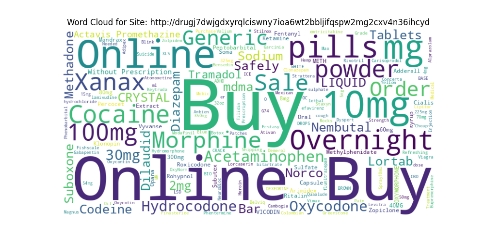

# 다크웹 크롤러 미니 프로젝트
### 팀원 : [서경호](https://github.com/Lanternbit), [조준형](https://github.com/TheMac223), [김상빈](https://github.com/qlsdlgh), [김남혁](https://github.com/namaek2), [박하은](https://github.com/yellowgree)

> ### 📔 설명
> 
> Tor 브라우저를 이용해 접속할 수 있는 마x 판매 사이트들을 선택해 판매하고 있는 상품들(x약)과 관련된 정보{URL, 상품 이름(product), 상품 가격(price)}를 크롤링하여 데이터 수집 후 DB로 전송한다.
> 
> 최종적으로 DB에 모인 각 사이트별 상품 판매 현황 데이터에 근거하여 시각화 작업을 진행했다.

## 다크웹 크롤링 (총 9개 사이트)
### 서경호
- Axxxx Store, 56개
- 상품 이름, 할인된 가격, 링크를 크롤링해서 파싱하였다. 카테고리와 상관없이 전체 상품을 한 번에 볼 수 있었기 때문에 현재 페이지 크롤링 후 다음 페이지로 넘어가는 기능까지만 구현하였다.

#### 파싱한 값 DB에 삽입하는 함수 작성

- insert_data()
    - 이 함수는 추출한 값을 DB에 삽입해 준다.
---
### 김남혁
- Ex xxxxx Store, 24개
- visit_onion 함수를 만들어 재귀로 사용함

#### html에서 카테고리 페이지를 찾아 방문

#### 카테고리 페이지에서 제품 페이지를 찾아 방문

#### 제품 페이지에서 제품명과 가격의 범위를 크롤링

- 가격 범위 string을 잘라 최솟값만을 구해 최솟값, 제품명, url을 db에 전송
- 제품명에서 각 그램 수에 따른 가격을 크롤링 하려 했지만 제품 마다 태그의 id가 달라 실패

---
### 조준형
- Dxxx sxxxx, 33개

- 상품 이름, 상품 가격, 링크를 크롤링해서 파싱하였다.
- extract_numbers 함수를 통해 가격표시 부분에서 숫자만을 추출함

- 파싱 후 추출데이터 DB 서버에 전송

---
### 박하은
- Exxxxxxx, 58개
- Rxxxxxxx, 90개
- Txxxxxxx, 45개
- Rxxxxxxx, 303개
- Exxxxxxx, 142개
- Sxxxxxxx, 28개
- 각 사이트의 구조가 유사해 전반적으로 크롤링 코드가 동작하는 방식이 매우 비슷하다.

| | | |
|---|---|---|
||||
||||

|사이트|특이사항|
|---|----|
|Rxx|판매하는 상품이 매우 다양해서 마x 관련 카테고리만 골라 크롤링을 진행하였다. Balance Transfer(Cashapp, Paypal, paytm, skrill), Electronics&Carded Items(game console, mobile phones), Luxury Items(watches)|
|Txx|카테고리와 상품이 매우 다양하여 마x 검색어를 통해 나오는 결과들만 크롤링 하였다.|
|Rxx|상품 개수가 제일 많다.|
|Exx|감정과 관련된 마x을 주로 판매한다.|

#### parse_product_info()

- 이 함수는 BeautifulSoup을 사용하여 상품 정보를 파싱한다. 주요 기능은 HTML 페이지에서 제품 이름과 가격을 추출하여 리스트에 저장하는 것이다.
#### visit_url()

- 이 함수는 주어진 URL에서 웹 페이지를 방문하여 데이터를 수집한다. Tor 네트워크를 통해 익명으로 페이지에 접속하기 위해 프록시를 설정하고 선택한 URI(다크 웹의 카테고리 페이지)를 반복하여 각 페이지의 상품 목록을 가져온다. 다음 페이지가 있는 경우, "다음" 버튼을 찾아서 다음 페이지로 이동한다.

|공통점|특이점|
|---|---|
|개발자 모드에서 확인한 페이지 요소들이 서로 매우 유사하다. |간혹 가격이 제시되어 있지 않은 상품들이 있어 예외 처리가 필요했다.|
|상품 이름은 h2태그에, 가격은 bdi 태그에 묶여있는 경우가 대다수|가격 형식이 제각각이어서 숫자 형태로 뽑아내는 것이 가장 까다로운 작업이었다. (소수점까지 있는 가격, 범위로 설정되어 있는 가격, $ 가 붙어있는 가격 등)|
|각각의 상품은 ul 태그 안에 있는데 class 이름이 거의 동일 (products columns-3, products columns-4 등)||
|다음 페이지로 넘어가기 위한 a태그  클래스명이 같음(next page-number)| |

## 백엔드 설계
### 김상빈
- DB 설계
    - mysql을 이용하여 db를 만들고 table을 다음과 같이 작성하였다.
- 서버 설정
    - local ip를 server ip로 설정하여, python코드를 이용해 접근하도록 하였다.

| | | |
|-|-|-|
|||

|Columns|Type|
|-------|----|
|nums(primary key)|int()|
|url|varchar(200)|
|price|int()|
|product|varchar(100)|

## 시각화
#### 사이트별 상품 이름으로 워드클라우드 제작

| | | |
|-|-|-|
||||
||||
||||

- 전체 데이터를 취합한 워드 클라우드 및 그래프

## 추후에 보완하고 싶은 점
#### 소비자들에 대한 깊은 분석
- 마x 관련 상품만 크롤링 하는 것이 아니라 판매하는 모든 상품을 크롤링했다면 사이트별로 x약과 함께 어떤 상품들이 함께 판매하는지, 즉 마x 소비자들은 어떤 서비스를 같이 찾는지 소비자들에 대해 더 분석할 수 있지 않았을까 하는 아쉬움이 남음
- url 데이터를 제대로 활용하지 못해 아쉬움이 남음

